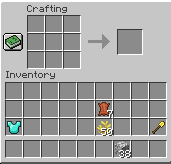
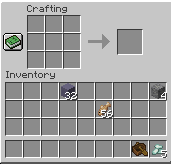
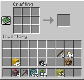
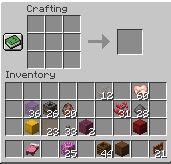

# plancraft

[](https://github.com/gautierdag/plancraft/actions/workflows/test.yaml)


[](https://pypi.org/project/plancraft/)
[](https://hub.docker.com/r/gautierdag/plancraft)


[Paper](https://arxiv.org/abs/2412.21033) | [Website](https://gautierdag.github.io/plancraft/)

Plancraft is a minecraft environment and agent that innovates on planning LLM agents with an oracle RAG retriever.

You can install the package by running the following command:

```bash
pip install plancraft
```

Or:

```bash
uv add plancraft
```







The package provides a multimodal environment and dataset for evaluating planning agents. The dataset consists of examples of crafting tasks in Minecraft, where the agent must craft a target object from a set of initial items. The environment is a simplified version of Minecraft where the agent can move items between slots in an inventory and smelt items to create new items. The agent must craft the target object by moving or smelting items around in the inventory.

## Usage

The package provides a `PlancraftEnvironment` class that can be used to interact with the environment. Here is an example of how to use it:

```python
from plancraft.environments.env import PlancraftEnvironment


def main():
    # Create the environment with an inventory containing 10 iron ores and 23 oak logs
    env = PlancraftEnvironment(
        inventory={
          10: dict(type="iron_ore", quantity=10),
          23: dict(type="oak_log", quantity=23)
        }
    )
    # move one log to slot 1
    move_action = MoveAction(from_slot=23, to_slot=1, quantity=1)
    observation = env.step(move_action)
    # observation["inventory"] contains the updated symbolic inventory
    # observation["image"] contains the updated image of the inventory

    # smelt one iron ore
    smelt_action = SmeltAction(from_slot=10, to_slot=11, quantity=1)
    observation = env.step(smelt_action)

    # no op
    observation = env.step()
```

Note that the environment is deterministic and stateful, so the same action will always lead to the same observation and the environment will keep track of the state of the inventory.

### Evaluator

The package also provides an `Evaluator` class that can be used to evaluate the performance of an agent on our specific dataset. Here is an example of how to use it:

```python
from plancraft.evaluator import Evaluator

def main():
    # create model -- Note you can create your own model by subclassing PlancraftBaseModel
    model = get_model("dummy")
    # Create the evaluator
    evaluator = Evaluator(run_name="dummy", model=model)
    # Evaluate the agent
    evaluator.eval_all_examples()
```

The evaluator class handles the environment loop and model interaction. The environment is created based on the configuration and the examples are loaded from the dataset. The `Evaluator` uses the dataset examples and initializes the environment with the example's inventory. It is also responsible for early stopping and verifying the target object has been craft. Finally, it also saves the results of the evaluation and the images generated during the evaluation.

#### The Evaluator interactive loop

The evaluator loop for each example is as follows:

```python
# Initialize success and non-environment actions counter
success = False
num_non_env_actions = 0

# Reset the environment and example
reset(example)

# Run the evaluation loop
while not history.check_stuck() and history.num_steps < max_steps:
    if action == StopAction:  # StopAction ends the episode
        success = example.impossible  # Success if task is impossible
        break
    elif isinstance(action, str) and num_non_env_actions < 3:  
        # Handle external tool action (str message)
        observation = {"message": action}
        num_non_env_actions += 1
    else:  
        # Handle environment action
        if isinstance(action, str):  
            # Handle invalid case (exceeded non-env action limit)
            observation = environment.step()
        else:
            observation = environment.step(action)

        # Convert observation to message and reset non-env counter
        observation["target"] = example.target
        observation["message"] = convert_observation_to_message(observation)
        num_non_env_actions = 0

        # Check if episode is complete
        success = check_done(observation["inventory"], example.target)

    if success:  # Exit loop if success
        break

    # Update history with observation and message
    history.add_observation_to_history(observation)
    history.add_message_to_history(content=observation["message"], role="user")
    # Model predicts next action
    raw_action = model.step(observation, dialogue_history=history)
    # Update history with predicted action
    history.add_message_to_history(content=raw_action, role="assistant")
    # Parse raw action into a structured format
    action = parse_raw_model_response(raw_action)

# Return results after evaluation
return {
    "success": success,
    "recipe_type": example.recipe_type,
    "complexity": example.complexity,
    "number_of_steps": history.num_steps,
    "model_trace": history.trace(),
    "example_id": example.id,
}
```

### Observation

The observation returned by the `PlancraftEnvironment` class is a dictionary with the following keys: `inventory` and `image`. The `inventory` key contains a dictionary with the slot number as the key and the item in the slot as the value (eg {"type": "iron_ingot", "quantity": 2}). The `image` key contains a numpy array representing the image of the inventory.

The observation returned by the `Evaluator` class is a dictionary with the following keys: `inventory`, `image`, `message`, and `target`. The `message` key contains a string representing the environment formatted in text (we follow the annotation scheme described in our paper). The `target` key contains a string representing the target object to be crafted.

### Implementing a Model

To implement a model, you need to subclass the `PlancraftBaseModel` class and implement the `step` and `reset` method. See the `plancraft.models.dummy` module for an example of how to implement a basic model.

You should then be able to use the `Evaluator` class to evaluate it.

## Reproducing the Results tables in the paper

To reproduce the results tables in the paper, you can use the `exps.sh` script in the `root` directory. The script will run the evaluation for all the models and seeds specified in the paper. The results will be saved in output directory but also on wandb if you have an account and set the `WANDB_API_KEY` environment variable.

## Docker

There is a docker image built to incorporate the latest code and its dependencies. I build it by running the following command:

```bash
docker buildx build --platform linux/amd64,linux/arm64 -t gautierdag/plancraft --push .
```

The image is available on [Docker Hub](https://hub.docker.com/r/gautierdag/plancraft). Note that, unlike the package, the docker image includes everything in the repo.

## To Do

Non-exhaustive list of things to do from highest to lowest priority:

- [ ] Add minecraft wiki scrape and non-oracle search for pages
- [ ] Improve planner to bring closer to optimal (the oracle planner does not consider  future crafting steps when moving items -- see paper for more details)
- [ ] Rerun image models with better bounding box model
  - [ ] Track bounding box accuracy
- [ ] Implement a version of the image environment entirely on cuda/pytorch rather than cpu

## PRs Welcomed

If you would like to contribute to the project, please feel free to open a PR. I am happy to review and merge PRs that improve the project. If you have any questions, feel free to create an issue or reach out to me directly.

## Citation

```bibtex
@misc{dagan2024plancraftevaluationdatasetplanning,
      title={Plancraft: an evaluation dataset for planning with LLM agents}, 
      author={Gautier Dagan and Frank Keller and Alex Lascarides},
      year={2024},
      eprint={2412.21033},
      archivePrefix={arXiv},
      primaryClass={cs.CL},
      url={https://arxiv.org/abs/2412.21033}, 
}
```
